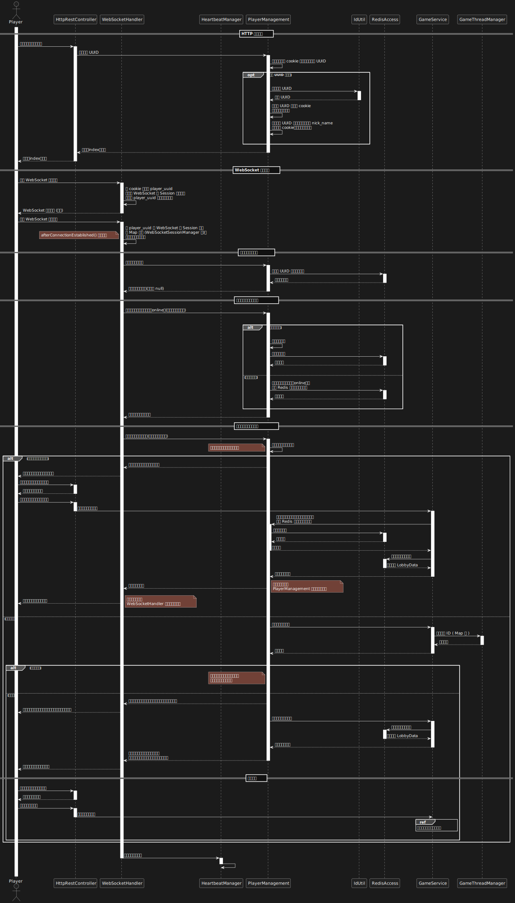
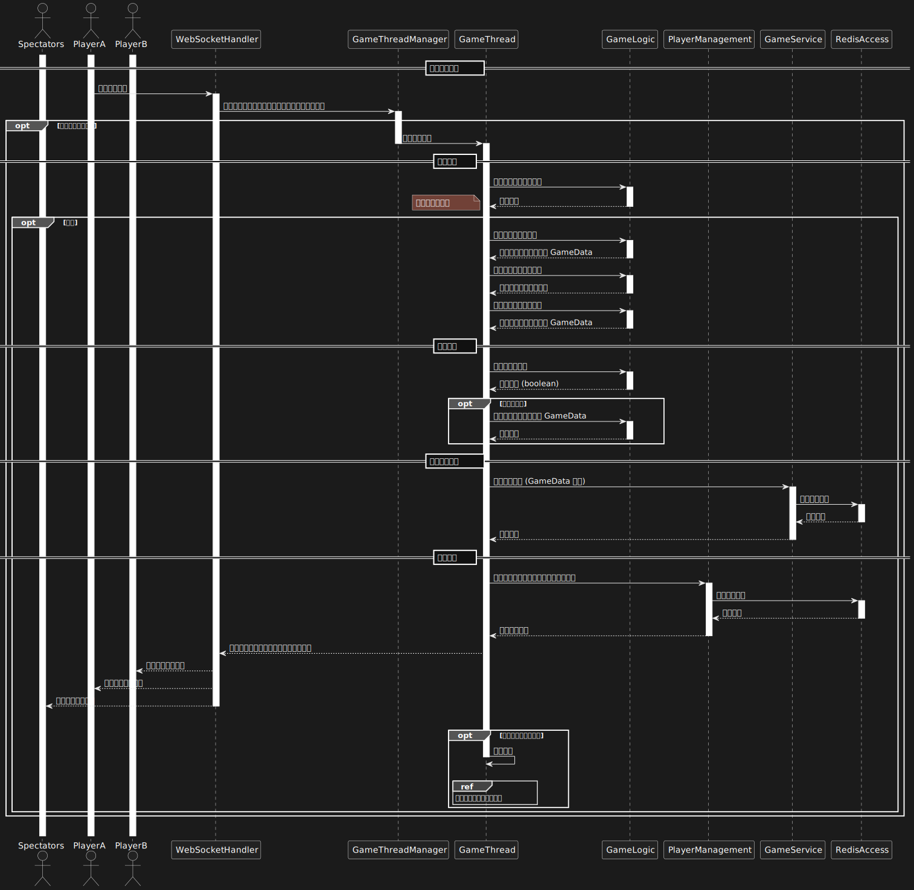
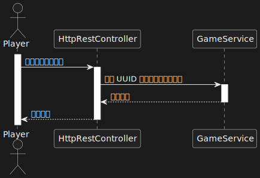
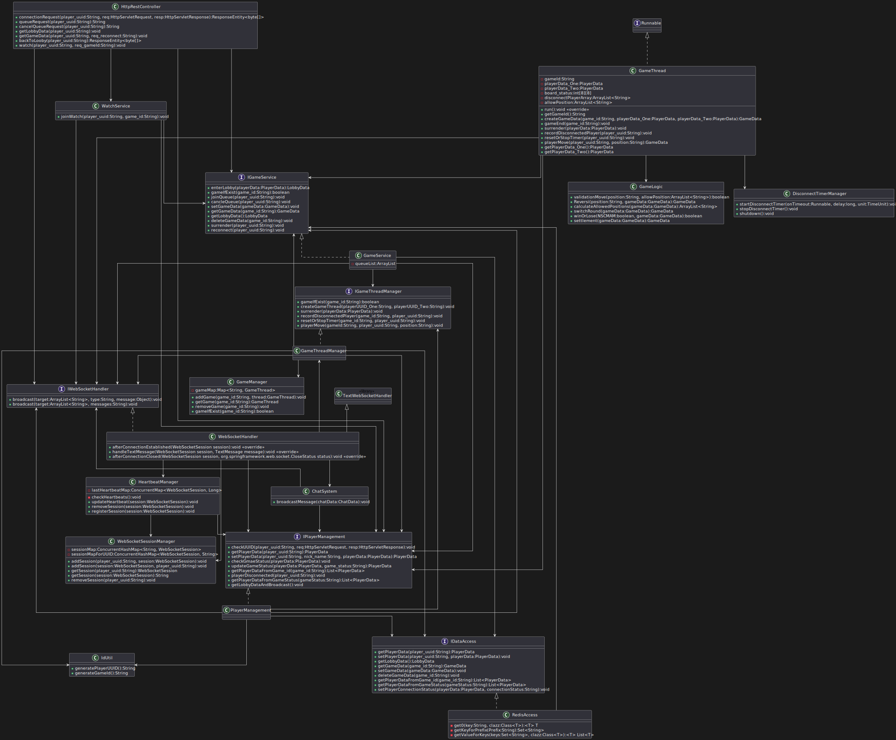

# 黑白棋 ( Reversi Online )

  

[關於](#關於)

[頁面與功能](#頁面與功能)

[系統設計](#系統設計)

[需求分析](#需求分析)

[UML 建模](#UML-建模)

[Redis 數據結構](#Redis-數據結構)

[Web API 設計](#Web-API-設計)

[用到的技術](#用到的技術)

---

# 關於

黑白棋 ( Reversi Online )，是一款透過瀏覽器即可進行對弈的網路黑白棋，玩家無需註冊會員即可進行對局。其中包含待機室、即時聊天、玩家對局、觀戰等功能。

該專案的主要目的在於練習以下技術：
- Spring Boot 後端框架技術的使用
- WebSocket 即時全雙工通訊 - 處理對局同步、聊天功能
- Redis - 暫存玩家數據、對局數據
- 多執行緒處理 - 處理多個不同的棋局
- UML 系統建模

GitHub：[reversi_online](https://github.com/LYH-94/reversi_online)

UI 設計：[Reversi online](https://www.figma.com/design/xZkkIagiOKJlOEd6kidLHC/Reversi-online?node-id=0-1&t=XvIsB9GLlsIkScgB-1)

Demo - http://linyaohua.ddns.net:7777/reversi_online/connectionRequest

※僅有「訪客」身分，無會員功能。

# 頁面與功能

兩個頁面分別為待機室頁面與對局頁面，如下：
- 待機室頁面
  - 顯示在線人數、玩家列表、對局列表及聊天訊息。
  - 點擊 “加入排隊” 按鈕時，該玩家加入隊伍，若隊伍中人數至少 2 人時，將自動開啟對局。
  - 在對局列表中，點擊 ”加入觀戰” 按鈕時，以觀戰者身分進入對局。
  - 在訊息輸入框中輸入文字訊息並點擊 “發送” 按鈕時，可於待機室中的其他玩家即時聊天。

  

- 對局頁面
  - 棋盤右側顯示玩家雙方所持白子還是黑子以及當前回合落子的棋子顏色，並於結束對局時將對局結果顯示於玩家右側。
  - 棋盤中，灰色正方形即表示允許落子的位置，直接點擊即可落子。
  - 點擊 “查看規則” 按鈕，可查看黑白棋基本規則。
  - 點擊 “返回待機室” 按鈕，可返回待機室。若對局尚未結束，則視為認輸。

  

# 系統設計

- 單體架構
- MVC 分層設計
- 前後端分離開發

## 需求分析

- 玩家識別
  - 每個請求連線的玩家將自動獲得唯一的訪客編號 ( UUID )。
  - 訪客編號僅用於識別玩家，不進行帳號系統管理。
  - 玩家暱稱由第一次連線時創建 UUID 的時間戳替代，暫不讓玩家自行設置暱稱。
- 玩家排隊與對局
  - 玩家可在待機室中選擇排隊等待對局。
  - 當存在至少兩位排隊的玩家時，自動建立對局，並將雙方帶入對局畫面。
  - 黑白棋遊戲按照標準規則進行。
- 待機室
  - 進入遊戲的玩家默認位於待機室。
  - 待機室內顯示當前所有在線人數、玩家列表。
  - 玩家可以透過按鈕進入排隊，等待對手進行對局。
  - 待機室顯示正在進行的對局列表，玩家可以選擇某個對局並觀戰。
- 聊天系統
  - 待機室聊天：所有在待機室的玩家皆可進行公開聊天。
- 觀戰功能
  - 玩家可選擇觀看正在進行的對局。
  - 觀戰者只能觀看棋盤變化，無法干涉對局。
- 連線管理
  - 使用 Redis 記錄對局狀態與玩家連線狀態，以便處理斷線重連。
  - 伺服器定期檢查在線玩家，清理長時間未響應的 WebSocket 連線。
- 斷線重連
  - 斷線玩家在重新連線後，可透過 UUID 找回原本的對局，並繼續遊戲。
  - 若對局雙方皆斷線，則該場對局將視為結束。

## UML 建模

使用案例圖

  

角色：

1. 玩家

   遊戲的主要使用者，能夠進行排隊、觀戰、聊天等操作。

使用案例：

1. 進入待機室：
- 玩家進入遊戲後，首先會進入待機室。
- 在待機室中，玩家可選擇排隊、觀戰或參與待機室內的聊天。
2. 文字聊天：
- 玩家可以在待機室內與其他在線玩家進行文字聊天。
3. 排隊：
- 玩家可以選擇排隊，等待與其他玩家進行對局。
- 包含 (`<<include>>`) “進入對局”，表示當有玩家可以進行對局時，玩家將進入對局畫面。
- 擴展 (`<<extend>>`) “斷線重連”。
  - 若玩家在對局過程中發生斷線，系統將記錄其遊戲狀態。
  - 當玩家重新連線時，可透過該功能恢復並繼續進行對局。
  - 此功能屬於 “例外情況”，因此使用 `<<extend>>`。
4. 選擇要觀戰的對局：
- 玩家可以瀏覽當前進行中的對局，並選擇一場進入觀戰模式。
- 包含 (`<<include>>`) “進入觀戰”，表示成功選擇後，玩家將進入觀戰畫面。

系統架構圖

  

節點：

本系統主要由 “客戶端 (瀏覽器)” 和 “伺服器 (Linux)” 組成，並且伺服器內部還包含 Tomcat 服務 及 Redis 服務。

1. 客戶端 ( 瀏覽器 )

   玩家透過瀏覽器進行遊戲，主要包含以下模組：

- UI 渲染

  使用 Vue3 來處理遊戲畫面的顯示與動態變化。

- 業務邏輯處理

  使用 JavaScript 來處理前端的業務，例如頁面切換、根據後端響應調用相應的處理函式等。

- 通訊處理

  使用 JavaScript 來處理與後端伺服器的通訊，支援 WebSocket 與 HTTP REST。

2. 伺服器 ( Linux )

   伺服器運行 Tomcat 服務來處理客戶端請求，並透過 Redis 服務來存儲玩家數據與對局數據，如下：

- Tomcat 服務

  部署於 Tomcat 之上的 Spring Boot 應用 ( WAR )，包含以下模組：

  - WebSocket 處理

    負責 WebSocket 連線與即時訊息傳輸，處理對局同步與聊天訊息。

  - HTTP REST 處理

    處理基於 HTTP 的業務邏輯，例如查詢規則、排隊/取消排隊請求、觀戰請求。

  - 遊戲邏輯處理

    負責遊戲規則運算、合法性檢查與對局流程控制。

  - 業務邏輯處理

    處理非遊戲相關的業務邏輯，例如玩家初次連線獲取 UUID 的處理、待機室所需數據查詢等。

  - Redis 連線存取

    作為 Spring Boot 應用與 Redis 數據庫的橋梁，負責處理數據的存取。

- Redis 服務

  用於存儲遊戲相關的數據：

  - 玩家數據

    儲存玩家的連線狀態與基本信息，例如是否在線、是否處於對局狀態、當前所在的對局房間等。

  - 對局數據

    儲存正在進行的對局狀態，例如棋盤資訊、棋手 ID 等。

循序圖

  

  
玩家連線

  

    
  

  

  

  
排隊與開啟對局

  

    
  

  

  

  
玩家對局

  

    
  

  

  

  
對局結束

  

    
  

  

  

  
聊天系統

  

    
  

  

  

  
觀戰功能

  

    
  

  

  

  
取消排隊

  

    
  

  

  

  
當玩家斷線時

  

    
  

  

  

  
返回待機室

  

    
  

  

  

  
斷線重連

  

    
  

  

類別圖

  

## Redis 數據結構

該專案於 Redis 儲存的數據結構有兩種，分別為 玩家數據 ( PlayerData ) 和 對局數據 ( GameData )，如下：

- 玩家數據 PlayerData

  Key：palyer_data:{player_uuid}

  Value：

  - id
  - player_uuid
  - nick_name

    用玩家初次連線時生成 UUID 的時間戳來作為暱稱。

  - game_status

    “lobby” | “ingame:{game_id}” | “watching:{game_id}”

  - connection_status

    "online" | “offline:{yyyy-mm-dd}”

- 對局數據 GameData

  Key：game_data:{game_id}

  Value：

  - id
  - game_id
  - white

    即白方玩家的 nick_name。

  - white_uuid
  - black

    即黑方玩家的 nick_name。

  - black_uuid
  - current_move

    “black” | “white”

  - board_status

    [[0]3*8,

    [0, 0, 0, 1, 2, 0, 0, 0,],

    [0, 0, 0, 2, 1, 0, 0, 0,],

    [0]3*8,]

    ※( 1=白、2=黑、3=黑子允許的位置、4=白子允許的位置 )

## Web API 設計

根據需求撰寫的同步 HTTP API 及事件驅動 API 如下：

[openapi.yaml](https://github.com/LYH-94/dietary_assistant/blob/main/docs/openapi.yaml)

[asyncapi.yaml](https://github.com/LYH-94/dietary_assistant/blob/main/docs/asyncapi.yaml)

## 用到的技術

- 前端：
  - HTML / JavaScript / CSS
  - Bootstrap ( v5.3.3 )
  - Vue3
- 後端：
  - Spring Boot 3 ( ver. 3.0.5 )
    - Spring MVC
    - Spring WebSocket
    - Spring Data Redis
    - Apache Tomcat
  - Java 17
  - Maven - ver. 3.8.4
    - maven-compiler-plugin - ver. 3.10.1
